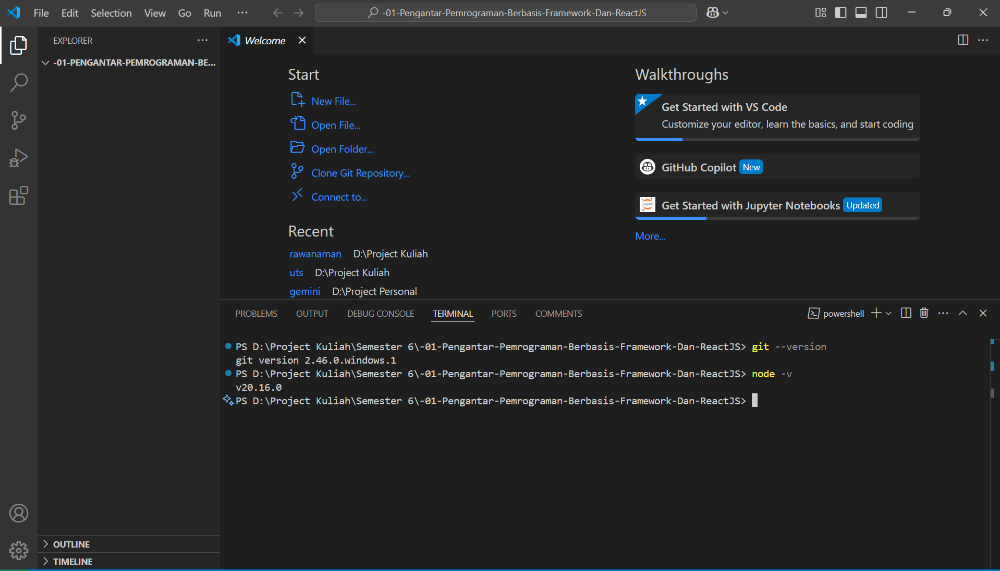
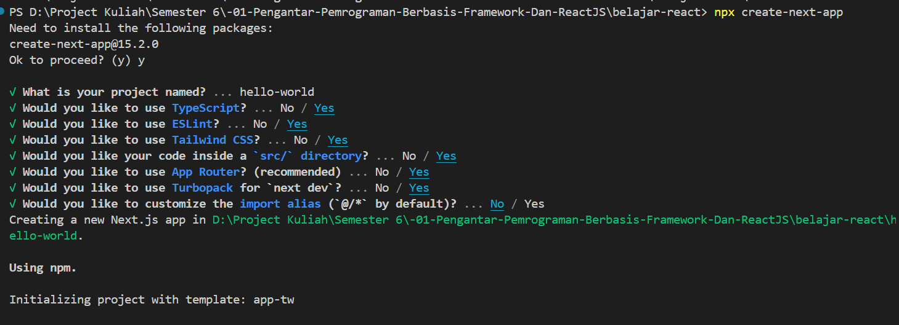
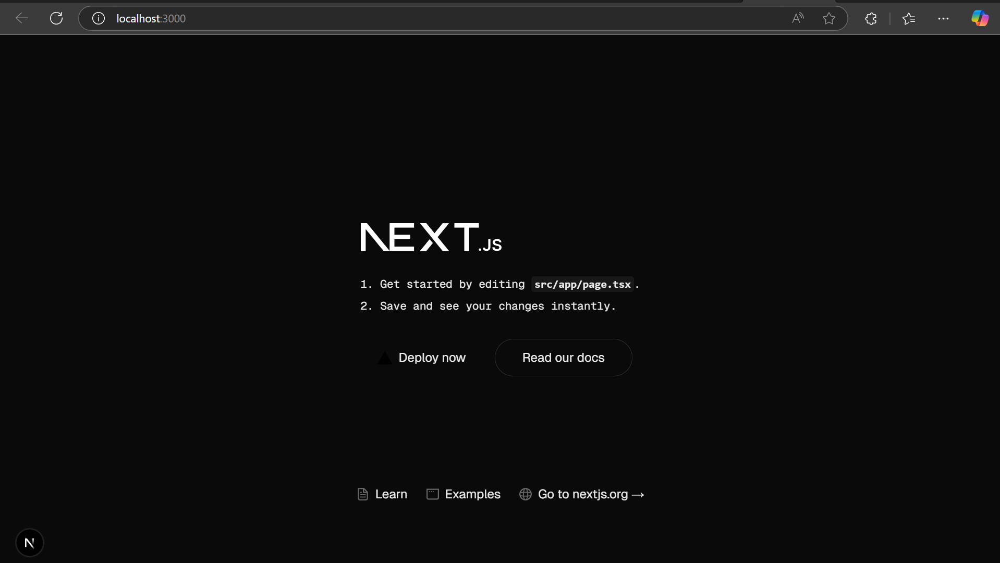
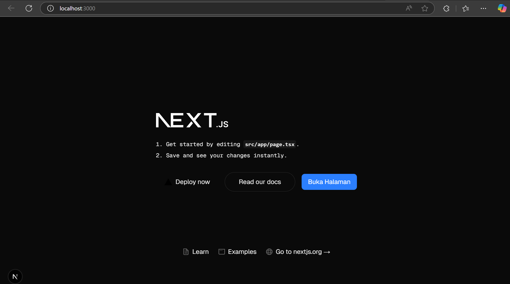

This is a [Next.js](https://nextjs.org) project bootstrapped with [`create-next-app`](https://nextjs.org/docs/app/api-reference/cli/create-next-app).

[Laporan Praktikum](#laporan-praktikum)

## Getting Started

First, run the development server:

```bash
npm run dev
# or
yarn dev
# or
pnpm dev
# or
bun dev
```

Open [http://localhost:3000](http://localhost:3000) with your browser to see the result.

You can start editing the page by modifying `app/page.tsx`. The page auto-updates as you edit the file.

This project uses [`next/font`](https://nextjs.org/docs/app/building-your-application/optimizing/fonts) to automatically optimize and load [Geist](https://vercel.com/font), a new font family for Vercel.

## Learn More

To learn more about Next.js, take a look at the following resources:

- [Next.js Documentation](https://nextjs.org/docs) - learn about Next.js features and API.
- [Learn Next.js](https://nextjs.org/learn) - an interactive Next.js tutorial.

You can check out [the Next.js GitHub repository](https://github.com/vercel/next.js) - your feedback and contributions are welcome!

## Deploy on Vercel

The easiest way to deploy your Next.js app is to use the [Vercel Platform](https://vercel.com/new?utm_medium=default-template&filter=next.js&utm_source=create-next-app&utm_campaign=create-next-app-readme) from the creators of Next.js.

Check out our [Next.js deployment documentation](https://nextjs.org/docs/app/building-your-application/deploying) for more details.

# Laporan Praktikum
|  | Pemrograman Berbasis Framework 2025 |
|--|--|
| NIM |  2241720044|
| Nama |  Muhammad Kemal Nugraha |
| Kelas | TI - 3B |

## Jawaban Praktikum 1
Bukti Screenshot Setup Git, VS Code dan Node.js


Jelaskan kegunaan masing-masing dari Git, VS Code dan NodeJS yang telah Anda install 
pada sesi praktikum ini! 

**Jawab:** 

- Git digunakan untuk mengatur versi dari software dan juga tempat bekerja sama antar sesama developer agar setiap kode yang dikerjakan sama. 
- VS Code digunakan sebagai text-editor untuk mengubah kode dan dapat diinstall berbagai extension untuk membantu pengerjaan kode. 
- NodeJS akan digunakan untuk package manager dengan NPM untuk menginstall dependensi react.

## Jawaban Praktikum 2
1. Pada Langkah ke-2, setelah membuat proyek baru menggunakan Next.js, terdapat beberapa 
istilah yang muncul. Jelaskan istilah tersebut, TypeScript, ESLint, Tailwind CSS, App 
Router, Import alias, App router, dan Turbopack!

    **Jawab:** 
    - Typescript adalah bahasa JavaScript yang lebih secure dan testruktur. 
    - ESLint adalah pendeteksi kesalahan pada kode JS maupun TS dan memberikan perbaikannya.
    - TailwindCSS adalah framework CSS yang menggunakan class based styling untuk customisasi CSS.
    - App Router adalah sistem routing di NextJS yang menggunakan file sistem routing dengan React Server Component. Mirip seperti web.php pada Laravel.
    - Import alias adalah adalah cara untuk membuat path import lebih pendek dan mudah dibaca seperti mengganti path '../../path' menjadi '@/path'
    - Turbopack adalah module bundler yang berfungsi untuk menggabungkan berbagai file (CSS, JS, dll.) menjadi satu atau beberapa file output agar lebih efisien di browser.


2. Apa saja kegunaan folder dan file yang ada pada struktur proyek React yang tampil pada 
gambar pada tahap percobaan ke-3!

    **Jawab:** 
    - .next adalah folder build output yang dibuat secara otomatis oleh NextJS setelah menjalankan next build
    - node_modules adalah folder yang menyimpan berbagai dependency atau package yg telah diinstall pada command npm install
    - public adalah folder yang digunakan untuk menyimpan aset statis seperti gambar logo
    - src/app adalah folder utama untuk routing dan komponen utama dalam app router
    - favicon.ico adalah file icon yang akan muncul pada tab browser
    - globals.css adalah file CSS yang akan diterapkan diseluruh aplikasi
    - layout.tsx adalah file layout utama untuk diterapkan ke semua halaman
    - page.tsx berfungsi sebagai halaman utama atau /
    - .gitignore berisi nama file/ folder yang tidak boleh ditrack oleh git
    - eslint.config.mjs adalah file konfigurasi ESLint
    - next-env.d.ts digunakan untuk Typescript typing secara otomatis
    - next.config.ts adalah file konfigurasi untuk Next.js
    - package-lock.json adalah daftar nama dependecy, script atau metadata yang digunakan
    - package.json adalah daftar nama dependecy, script atau metadata yang digunakan
    - tailwind.config.js adalah file konfigurasi TailwindCSS
    - tsconfig.json adalah file konfigurasi TypeScript

3. Bukti ScreenShot

Membuat Project React


Berhasil membuat project React


Berhasil menjalankan kode awal



## Jawaban Praktikum 3
Bukti Screenshot


## Jawaban Praktikum 4
1. Untuk apakah kegunaan sintaks user.imageUrl?

    **Jawab:** sintaks tersebut berguna untuk mengembalikan field imageUrl dari variable user dimana isinya adalah gambar.

2. Bukti Screenshot
