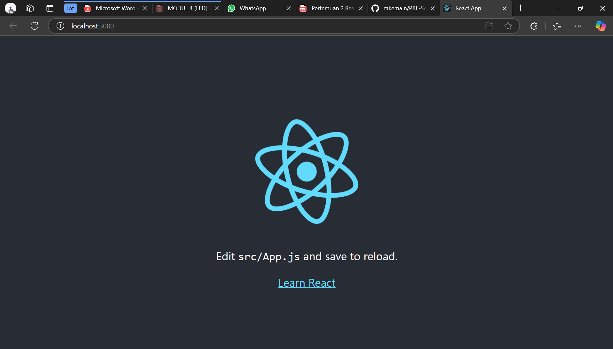
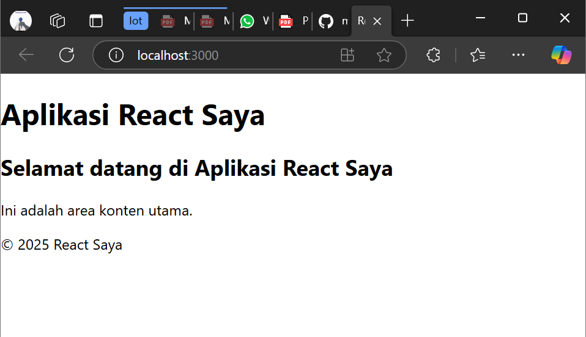
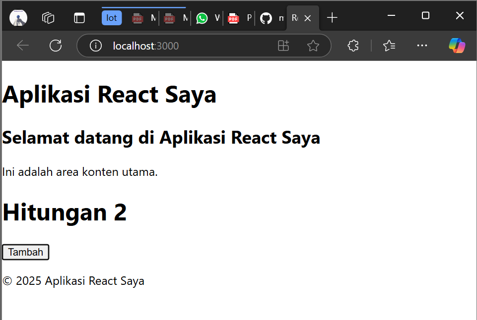
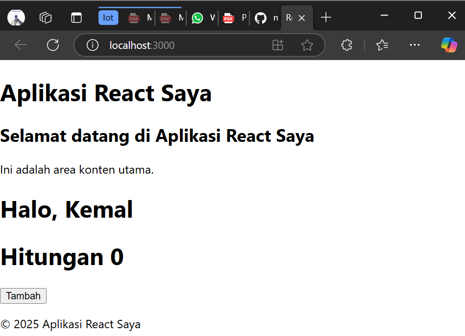
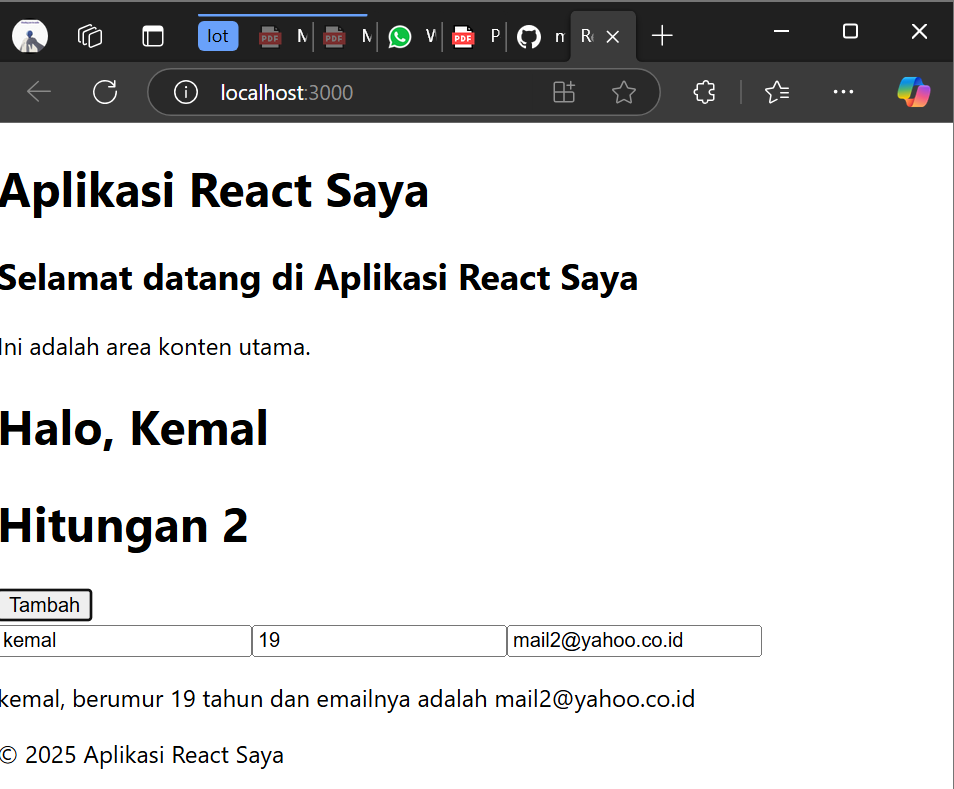
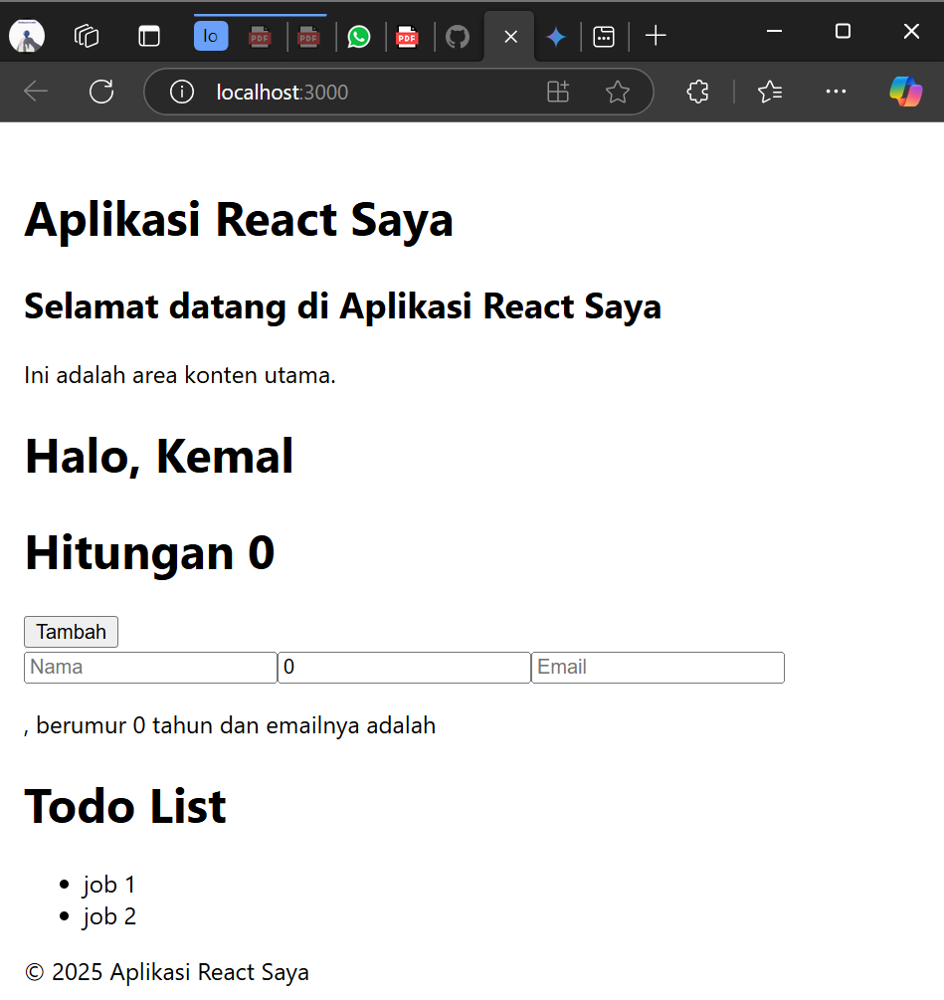
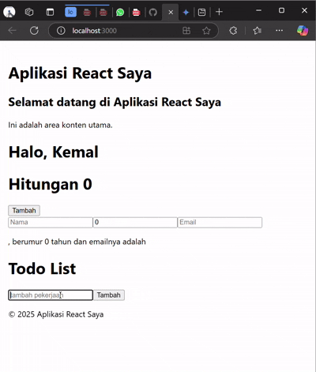
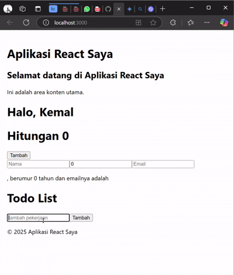

# Laporan Praktikum
- [Langkah 1](#langkah-1---persiapan-lingkungan)
- [Langkah 2](#langkah-2---membuat-komponen-react)
- [Langkah 3](#langkah-3---menggunakan-jsx-untuk-membuat-komponen-dinamis)
- [Langkah 4](#langkah-4---menggunakan-props-untuk-mengirim-data)
- [Langkah 5](#langkah-5-menggunakan-state-untuk-mengelola-data)
- [Tugas](#tugas)

|  | Pemrograman Berbasis Framework 2025 |
|--|--|
| NIM |  2241720044|
| Nama |  Muhammad Kemal Nugraha |
| Kelas | TI - 3B |

## Langkah 1 - Persiapan Lingkungan 

Berhasil Membuat Project React



## Langkah 2 - Membuat Komponen React 

Berhasil Membuat Komponen React



## Langkah 3 - Menggunakan JSX untuk Membuat Komponen Dinamis 

Berhasil Membuat Komponen Dinamis React



## Langkah 4 - Menggunakan Props untuk Mengirim Data

mengembalikan nama dengan,
```javascript
<Greeting name="Kemal" />
```
yang ditaruh pada App()

Bukti keberhasilan



##  Langkah 5 - Menggunakan State untuk Mengelola Data 

Bukti keberhasilan



## Tugas
1. Buat komponen baru bernama TodoList yang menampilkan daftar tugas (todo list). Gunakan state untuk mengelola daftar tugas dan props untuk mengirim data tugas ke komponen anak. 

code:

```javascript
import React, { useState } from "react";

// Melakukan destrukturisasi pada props
function TodoItem({ todo }) {
    return <li>{todo}</li>;
}

function TodoList() {
    const [todos, setTodos] = useState(["job 1", "job 2"]);
    const [text, setText] = useState("");

    return (
        <div>
            <h1>Todo List</h1>

            {/* melakukan perulangan pada array todos untuk diubah menjadi TodoItem */}
            <ul>
                {todos.map((todo, index) => (
                    <TodoItem key={index} todo={todo}/>
                ))}
            </ul>
        </div>
    );
}

export default TodoList;
```

hasil:



2. Tambahkan fitur untuk menambahkan tugas baru ke dalam daftar menggunakan form input. 

code:

```javascript
import React, { useState } from "react";

// Melakukan destrukturisasi pada props
function TodoItem({ todo }) {
    return <li>{todo}</li>;
}

function TodoList() {
    const [todos, setTodos] = useState([]);
    const [text, setText] = useState("");

    // Menangani perubahan input pada form
    function handleChange(e) {
        setText(e.target.value);
    }

    // Menangani submit form untuk mengirim ke fungsi handleChange
    function handleSubmit(e) {
        e.preventDefault();
        setTodos([...todos, text]);
        setText("");
    }

    return (
        <div>
            <h1>Todo List</h1>

            {/* melakukan perulangan pada array todos untuk diubah menjadi TodoItem */}
            <ul>
                {todos.map((todo, index) => (
                    <TodoItem key={index} todo={todo} />
                ))}
            </ul>

            {/* form untuk menambahkan todo */}
            <form onSubmit={handleSubmit}>
                <input type="text" value={text} onChange={handleChange} placeholder="tambah pekerjaan"/>
                <button type="submit">Tambah</button>
            </form>
        </div>
    );
}

export default TodoList;
```



3. Implementasikan fitur untuk menghapus tugas dari daftar.

code:

```javascript
import React, { useState } from "react";

// Melakukan destrukturisasi pada props
function TodoItem({ todo, index, handleDelete }) {
    return <li>
        <span style={{marginRight: 20}}>{todo}</span>
        <button onClick={() => handleDelete(index)}>Hapus</button>
        </li>;
}

function TodoList() {
    const [todos, setTodos] = useState([]);
    const [text, setText] = useState("");

    // Menangani perubahan input pada form
    function handleChange(e) {
        setText(e.target.value);
    }

    // Menangani submit form untuk mengirim ke fungsi handleChange
    function handleSubmit(e) {
        e.preventDefault();
        setTodos([...todos, text]);
        setText("");
    }

    // Menghapus todo/ pekerjaan berdasarkan index
    function handleDelete(index) {
        const newTodos = [...todos];
        newTodos.splice(index, 1);
        setTodos(newTodos);
    }

    return (
        <div>
            <h1>Todo List</h1>

            {/* melakukan perulangan pada array todos untuk diubah menjadi TodoItem */}
            <ul>
                {todos.map((todo, index) => (
                    <TodoItem key={index} todo={todo} index={index} handleDelete={handleDelete} />
                ))}
            </ul>

            {/* form untuk menambahkan todo */}
            <form onSubmit={handleSubmit}>
                <input type="text" value={text} onChange={handleChange} placeholder="tambah pekerjaan"/>
                <button type="submit">Tambah</button>
            </form>
        </div>
    );
}

export default TodoList;
```

hasil:


