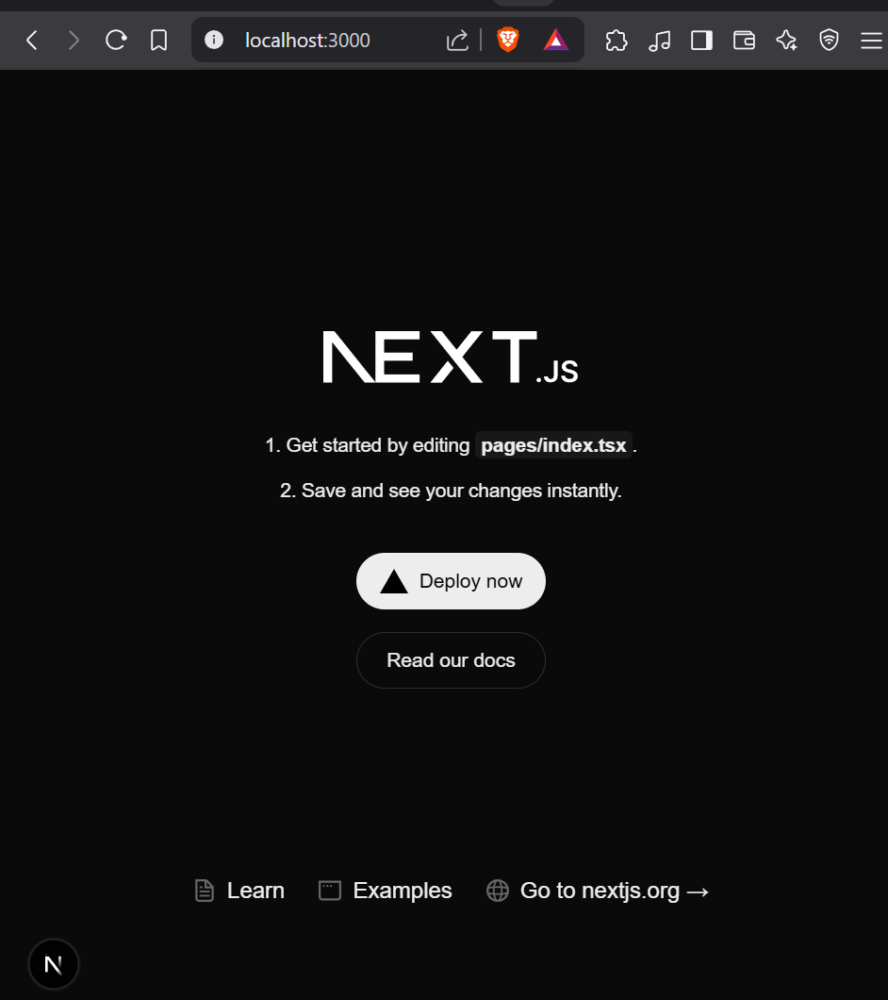
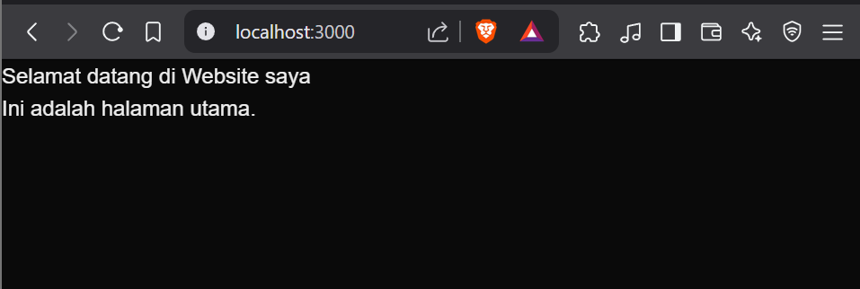
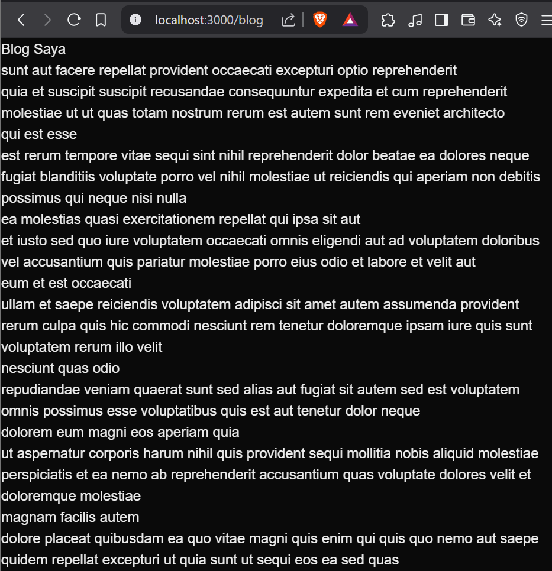
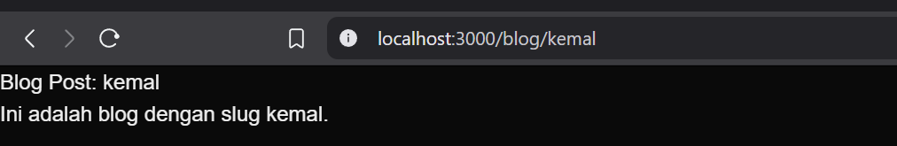
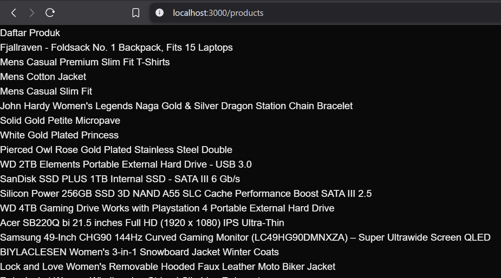
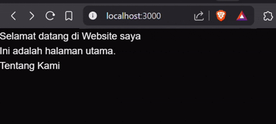
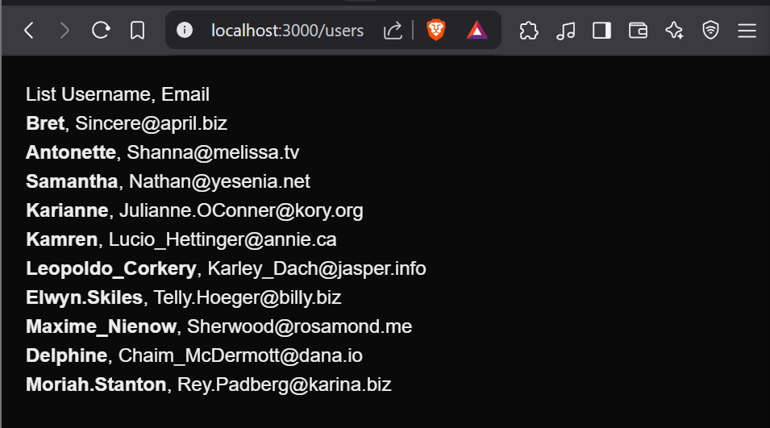
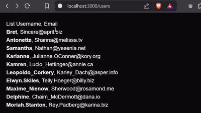
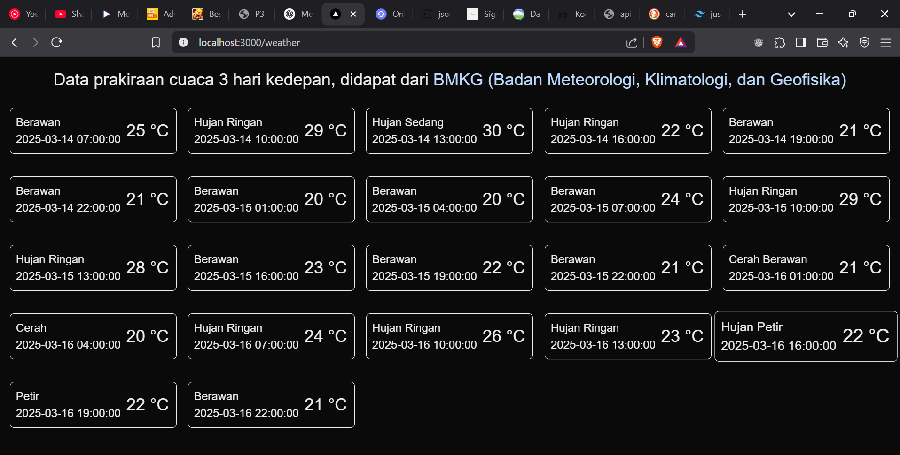

# Laporan Praktikum
- [Langkah 1](#langkah-1---persiapan-lingkungan)
- [Langkah 2](#langkah-2---membuat-komponen-react)
- [Langkah 3](#langkah-3---menggunakan-jsx-untuk-membuat-komponen-dinamis)
- [Langkah 4](#langkah-4---menggunakan-props-untuk-mengirim-data)
- [Langkah 5](#langkah-5-menggunakan-state-untuk-mengelola-data)
- [Tugas](#tugas)

|  | Pemrograman Berbasis Framework 2025 |
|--|--|
| NIM |  2241720044|
| Nama |  Muhammad Kemal Nugraha |
| Kelas | TI - 3B |

## 1. Persiapan Lingkungan 

Berhasil Membuat Project Next Baru



## 2. Membuat Halaman dengan Server-Side Rendering (SSR)

Hasil Langkah 2



## 3. Menggunakan Static Site Generation

Hasil Langkah 3



## 4. Menggunakan Dynamic Routes

Mencoba mengubah nama slug dengan nama sendiri.

Bukti keberhasilan Langkah 4



## 5. Menggunakan API Routes

Hasil Langkah 5



## 5. Menggunakan Link Componen

Hasil Langkah 6



## Tugas
1. Buat halaman baru dengan menggunakan Static Site Generation (SSG) yang menampilkan daftar
pengguna dari API https://jsonplaceholder.typicode.com/users.

kode:

```javascript
import React from 'react';

const Users = ({ users }) => {    
    return (
        <div style={{ margin: '20px' }}>
            <h1>List Username, Email</h1>
            <ul>
                {users.map((user) => (
                    <div key={user.id}>
                        <li><span style={{fontWeight: 'bold'}}>{user.username}</span>, {user.email}</li>
                    </div>
                ))}
            </ul>
        </div>
    );
};

// mengambil data username dari API dan menyimpannya kedalam properti
export async function getStaticProps() {
    const res = await fetch('https://jsonplaceholder.typicode.com/users');
    const users = await res.json();

    return {
        props: {
            users,
        },
    };
}

export default Users;

```

Hasil akhir



2. Implementasikan Dynamic Routes untuk menampilkan detail pengguna berdasarkan ID.

kode

```javascript
import { useRouter } from "next/router";

const UserDetail = ({ user }) => {
  return (
    <ul style={{ margin: '20px' }}>
        <h1>User Detail</h1>
        <div key={user.id}>
            <li>Data from @{user.username}</li>
            <li>Name: {user.name}</li>
            <li>Email: {user.email}</li>
            <li>Phone: {user.phone}</li>
            <li>Website: {user.website}</li>
        </div>
    </ul>
  );
};

// untuk menyimpan path static agar tidak perlu me-render path lagi
export async function getStaticPaths() {
    const res = await fetch('https://jsonplaceholder.typicode.com/users');
    const users = await res.json();

    // path yang disimpan merupakan id yang dikonversi menjadi string
    const paths = users.map((user) => ({
        params: { slug: user.id.toString() },
    }));

    return { paths, fallback: false };
}

// untuk menyimpan data user pada properti
export async function getStaticProps({ params }) {
    const res = await fetch(`https://jsonplaceholder.typicode.com/users/${params.slug}`);
    const user = await res.json();

    return {
        props: {
            user,
        },
    };
}

export default UserDetail;

```

Hasil akhir

Saya menambahkan sedikit CSS agar lebih menarik



3. Buat API route yang mengembalikan data cuaca dari API eksternal (misalnya, OpenWeatherMap)
dan tampilkan data tersebut di halaman front-end.

**kode API weather**

```javascript
export default async function handler(req, res) {
    // kode wilayah menggunakan wilayah Malang, Lowokwaru, Dinoyo 
    const response = await fetch(`https://api.bmkg.go.id/publik/prakiraan-cuaca?adm4=35.73.05.1004`);
    const weather = await response.json();
    
    res.status(200).json(weather);
}
```

**kode tampilan page weather**

```javascript
import { useState, useEffect } from "react";

const WeatherStatus = () => {
    const [weathers, setWeather] = useState<{ local_datetime: string, weather_desc: string, t: number }[]>([]);

    useEffect(() => {
        const fetchWeathers = async () => {
            const response = await fetch('/api/weather');
            const weather = await response.json();

            // karena data json adalah nested array maka perlu di flatten agar hanya mengambil data pada array cuaca saja.
            const nestedCuaca = weather.data[0].cuaca;
            const flattenedCuaca = nestedCuaca.flat();
            setWeather(flattenedCuaca);
        };

        fetchWeathers();
    }, []);

    return (
        <div className="m-4">
            <h1 className="text-2xl text-center mb-4">Data prakiraan cuaca 3 hari kedepan, didapat dari <a href="https://bmkg.go.id" className="text-blue-200 hover:text-blue-500">BMKG (Badan Meteorologi, Klimatologi, dan Geofisika)</a></h1>
            <div className="grid grid-cols-5 gap-4">
                {weathers.map((weather) => (
                    <div key={weather.local_datetime} className="border rounded-md p-2 my-2 hover:scale-110 transform transition duration-300 ease-in-out">
                        <div className="flex flex-row">
                            <div className="">
                                {weather.weather_desc}
                                <br />
                                {weather.local_datetime}
                            </div>
                            <div className="ml-2 my-auto text-2xl">
                                {weather.t} °C
                            </div>
                        </div>                        
                    </div>
                ))}
            </div>            
        </div>
    );
};

export default WeatherStatus;
```

Hasil akhir

Saya menambahkan kode tailwind agar tampilan lebih menarik. Data yang diambil adalah local_datetime, weather_desc dan t (suhu). 

