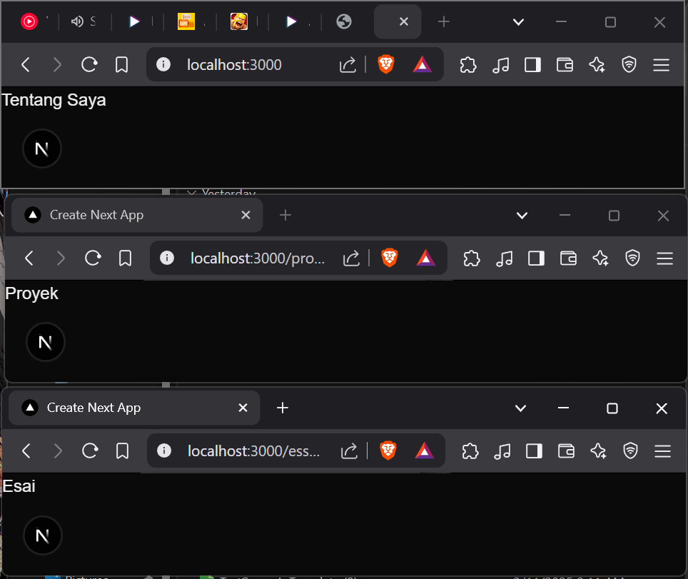
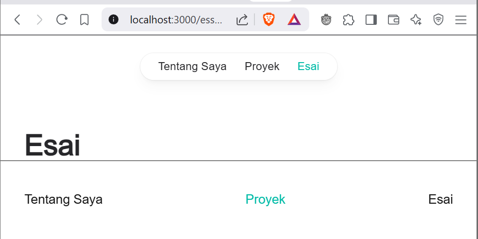
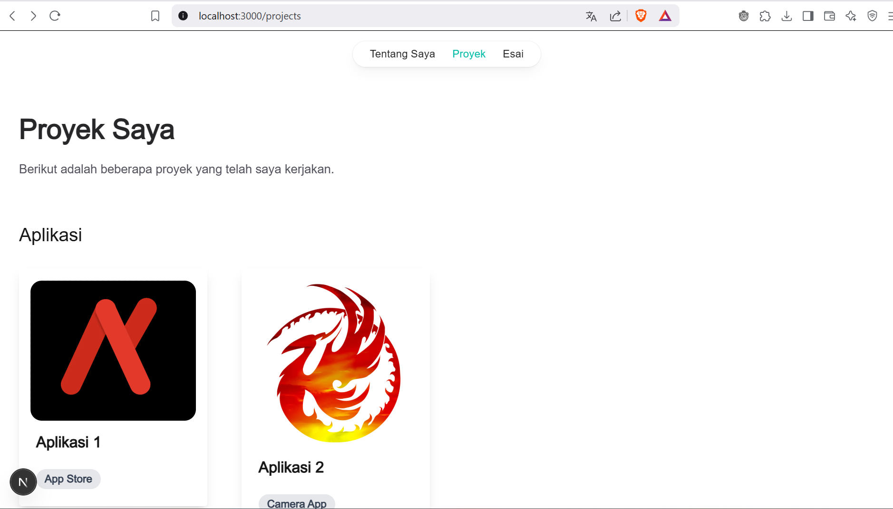
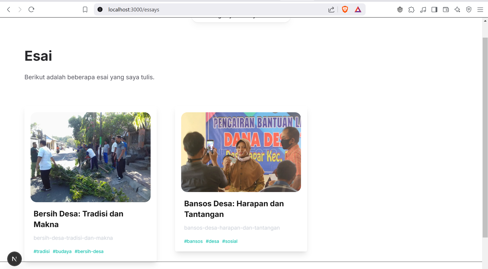
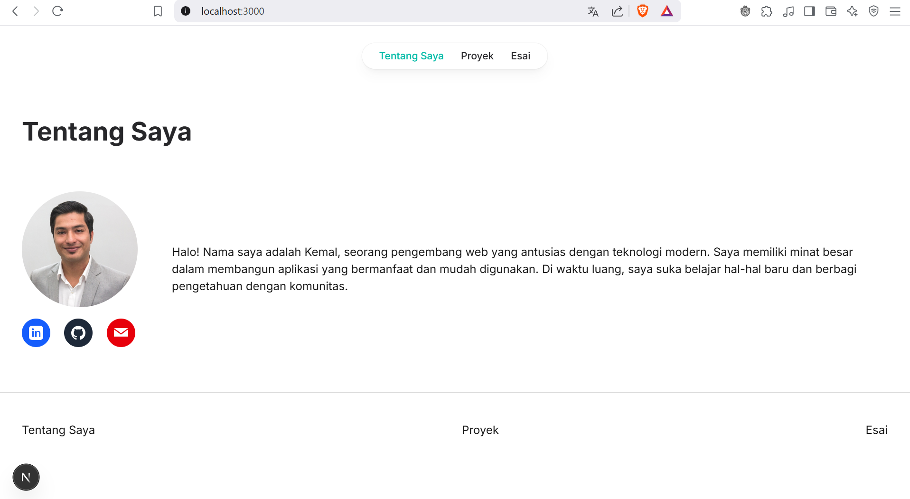

# Laporan Praktikum
- [Langkah 1](#1-persiapan-lingkungan)
- [Langkah 2](#2-membuat-halaman-website)
- [Langkah 3](#3-membuat-layout-dan-navigasi)
- [Langkah 4](#4-membuat-halaman-proyek-dengan-grid-responsif)
- [Tugas](#tugas)

|  | Pemrograman Berbasis Framework 2025 |
|--|--|
| NIM |  2241720044|
| Nama |  Muhammad Kemal Nugraha |
| Kelas | TI - 3B |

## 1. Persiapan Lingkungan 

## 2. Membuat Halaman Website



## 3. Membuat Layout dan Navigasi



## 4. Membuat Halaman Proyek dengan Grid Responsif


## Tugas
1. Modifikasi halaman "Esai" dengan Grid daftar artikel yang telah ditulis.

kode:

```javascript
import type { Metadata } from "next";
import Image, { StaticImageData } from "next/image";
const image1 = {
  src: 'https://bubunan-buleleng.desa.id/assets/files/artikel/sedang_153810825420180928_081623.jpg',
  height: 500,
  width: 500,
};
const image2 = {
  src: 'https://cdn.antarafoto.com/cache/1200x799/2020/05/20/bansos-dari-dana-desa-ppvo-dom.jpg',
  height: 500,
  width: 500,
};

type EssayItemProps = {
  name: string; 
  url: string;
  slug: string;
  tag: string[];
  imageSrc: StaticImageData;
};

export const metadata: Metadata = {
  title: 'Esai',
  description: 'Halaman esai',
  openGraph: {
    title: 'Esai',
    description: 'Halaman esai',
  }
}

function EssayItem({ name, url, slug, tag, imageSrc }: EssayItemProps) {
  return (
      <li>
        <a href={url}>
          <div className="max-w-sm rounded overflow-hidden shadow-lg">
            <Image className="w-full rounded-4xl p-4" src={imageSrc} alt={name}></Image>
            <div className="px-6">
              <div className="font-bold text-xl mb-2">
                {name}
              </div>
            </div>
            <div className="px-6">
              <p className="text-gray-300 py-1 text-sm mr-2 mb-2 overflow-clip">
                {slug}
              </p> 
            </div>
            <div className="px-6 pb-4">
                {tag.map((t, index) => (
                  <span key={index} className="py-1 text-xs text-teal-500 mr-2 mb-2">
                  {"#"+t}
                  </span>
                ))}
            </div>
          </div>
        </a>
      </li>
    );
}


export default function Esai() {
    return (
        <div className="mt-16 px-8">
          <div className="mt-16 px-8">
          <header>
            <h1 className="font-bold text-4xl text-zinc-800 dark:text-white">Esai</h1>
            <p className="text-base mt-6 text-zinc-600 dark:text-white">Berikut adalah beberapa esai yang saya tulis.</p>
          </header>
          <div className="mt-16">
            <ul className="grid grid-cols-1 md:grid-cols-2 lg:grid-cols-3 gap-x-12 gap-y-16 mt-8">
                <EssayItem 
                  name="Bersih Desa: Tradisi dan Makna" 
                  slug="bersih-desa-tradisi-dan-makna" 
                  tag={["tradisi", "budaya", "bersih-desa"]} 
                  url="https://example.com/bersih-desa" 
                  imageSrc={image1}>
                </EssayItem>
                <EssayItem 
                  name="Bansos Desa: Harapan dan Tantangan" 
                  slug="bansos-desa-harapan-dan-tantangan" 
                  tag={["bansos", "desa", "sosial"]} 
                  url="https://example.com/bansos-desa" 
                  imageSrc={image2}>
                </EssayItem>
            </ul>
          </div>
        </div>
        </div>
      );
}
```

hasil:



2. Modifikasi halaman “Tentang Saya” Buat tampilan yang menarik 

kode:

```javascript
import type { Metadata } from "next";

export const metadata: Metadata = {
  title: 'Tentang Saya',
  description: 'Halaman tentang saya',
  openGraph: {
    title: 'Tentang Saya',
    description: 'Halaman tentang saya',
  }
}

export default function Home() {
  return (
    <div className="mt-16 px-8">
      <header>
        <h1 className="font-bold text-4xl text-zinc-800 dark:text-white">Tentang Saya</h1>
      </header>
      <div className="mt-16 mb-16">
        <div className="grid grid-cols-1 md:grid-cols-6 gap-x-12 place-items-center gap-y-16 mt-8">
          <div className="col-span-1 flex-row">
            
            <div className="grid grid-cols-3 gap-x-4 mt-4">
              <a href="https://www.linkedin.com/in/your-profile" target="_blank" rel="noopener noreferrer" className="flex items-center justify-center w-10 h-10 bg-blue-600 text-white rounded-full hover:bg-blue-700">
                <svg xmlns="http://www.w3.org/2000/svg" fill="currentColor" viewBox="0 0 24 24" className="w-5 h-5">
                  <path d="M19 0h-14c-2.761 0-5 2.239-5 5v14c0 2.761 2.239 5 5 5h14c2.761 0 5-2.239 5-5v-14c0-2.761-2.239-5-5-5zm-11 19h-3v-10h3v10zm-1.5-11.268c-.966 0-1.75-.784-1.75-1.75s.784-1.75 1.75-1.75 1.75.784 1.75 1.75-.784 1.75-1.75 1.75zm13.5 11.268h-3v-5.604c0-1.337-.027-3.063-1.867-3.063-1.868 0-2.155 1.459-2.155 2.967v5.7h-3v-10h2.881v1.367h.041c.401-.759 1.379-1.559 2.841-1.559 3.037 0 3.6 2.001 3.6 4.604v5.588z" />
                </svg>
              </a>
              <a href="https://github.com/your-username" target="_blank" rel="noopener noreferrer" className="flex items-center justify-center w-10 h-10 bg-gray-800 text-white rounded-full hover:bg-gray-900">
                <svg xmlns="http://www.w3.org/2000/svg" fill="currentColor" viewBox="0 0 24 24" className="w-5 h-5">
                  <path d="M12 .297c-6.63 0-12 5.373-12 12 0 5.303 3.438 9.8 8.205 11.387.6.113.82-.258.82-.577v-2.234c-3.338.724-4.033-1.416-4.033-1.416-.546-1.387-1.333-1.757-1.333-1.757-1.089-.744.084-.729.084-.729 1.205.084 1.838 1.236 1.838 1.236 1.07 1.835 2.809 1.305 3.495.998.108-.775.418-1.305.762-1.605-2.665-.305-5.466-1.332-5.466-5.93 0-1.31.469-2.381 1.236-3.221-.123-.303-.536-1.523.117-3.176 0 0 1.008-.322 3.301 1.23.957-.266 1.983-.399 3.003-.404 1.02.005 2.047.138 3.006.404 2.291-1.552 3.297-1.23 3.297-1.23.653 1.653.241 2.873.118 3.176.77.84 1.234 1.911 1.234 3.221 0 4.61-2.805 5.623-5.475 5.921.43.372.823 1.102.823 2.222v3.293c0 .322.218.694.825.576 4.765-1.587 8.2-6.084 8.2-11.386 0-6.627-5.373-12-12-12z" />
                </svg>
              </a>
              <a href="mailto:your-email@example.com" className="flex items-center justify-center w-10 h-10 bg-red-600 text-white rounded-full hover:bg-red-700">
                <svg xmlns="http://www.w3.org/2000/svg" fill="currentColor" viewBox="0 0 24 24" className="w-5 h-5">
                  <path d="M12 12.713l11.985-8.713h-23.97l11.985 8.713zm0 2.287l-12-8.713v12h24v-12l-12 8.713z" />
                </svg>
              </a>
            </div>
          </div>
          <p className="col-span-5">
            Halo! Nama saya adalah Kemal, seorang pengembang web yang antusias dengan teknologi modern. 
            Saya memiliki minat besar dalam membangun aplikasi yang bermanfaat dan mudah digunakan. 
            Di waktu luang, saya suka belajar hal-hal baru dan berbagi pengetahuan dengan komunitas.
          </p>
        </div>
        
      </div>
    </div>
  );
}
```

hasil:


